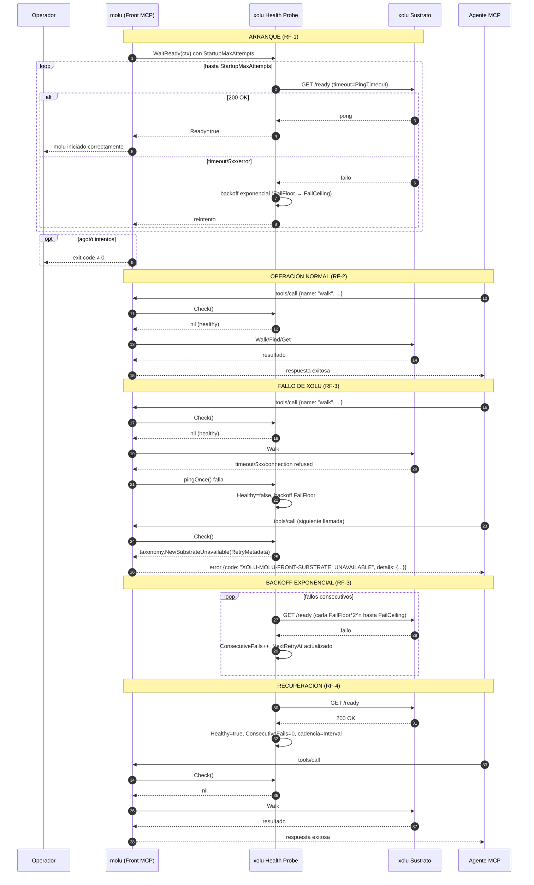

# Plan Técnico: Spec 002 — xolu Probe

## Archivos y Responsabilidades

| Archivo | Responsabilidad |
|---------|-----------------|
| `pkg/exec/probe.go` | **Modificar**: Sonda de salud existente. Integrar con taxonomía tipada: `Check()` debe retornar `*taxonomy.TypedError` con código `XOLU-MOLU-FRONT-SUBSTRATE_UNAVAILABLE` y `RetryMetadata` completo (RF-3, RF-4, RF-5). |
| `pkg/exec/probe_test.go` | **Modificar/Extender**: Tests unitarios existentes (backoff, cadencia, recovery). Añadir tests que validen retorno de `SUBSTRATE_UNAVAILABLE` con estructura correcta (RF-3, RF-4, RF-5). |
| `pkg/config/config.go` | **Ya existe**: Carga y validación de `MOLU_FRONT_PING_INTERVAL`, `MOLU_FRONT_PING_TIMEOUT`, `MOLU_FRONT_PONG_FRESHNESS`, `MOLU_FRONT_PING_FAIL_FLOOR`, `MOLU_FRONT_PING_FAIL_CEILING`, `MOLU_FRONT_STARTUP_MAX_ATTEMPTS` con defaults documentados (RF-6). |
| `pkg/config/config_test.go` | **Ya existe**: Tests de validación de variables de entorno. |
| `pkg/taxonomy/types.go` | **Ya existe**: `RetryMetadata` con `LastSuccessfulContact`, `NextRetryAt`, `AttemptNumber`, `MaxAttempts` (RF-5). |
| `pkg/taxonomy/errors.go` | **Ya existe**: `NewSubstrateUnavailable()` constructor con prefijo `XOLU-MOLU-FRONT-SUBSTRATE_UNAVAILABLE` (RF-5). |
| `pkg/taxonomy/integration_test.go` | **Modificar/Extender**: Añadir test de integración dedicado `TestIntegration_SubstrateUnavailable_WithProbe` que valida flujo completo: probe down → tool call → `SUBSTRATE_UNAVAILABLE` con `RetryMetadata` completo (RF-5, Criterio 2). |
| `pkg/xolu/client.go` | **Ya existe**: Interfaz `XoluClient` con `Ping(ctx)` y `Ready(ctx)` (via `Pinger`). Mock en `client_mock.go`. |
| `cmd/molu/main.go` | **Modificar**: Wiring de `WaitReady` al arranque (RF-1), lanzamiento de `Run` en goroutine, inyección del probe en ejecutores de tool calls y polls (RF-2). |
| `docs/diagrams/002-xolu-probe-sequence.mmd` | **Crear**: Diagrama de secuencia Mermaid (fuente) para: arranque con backoff, cadencia normal, fallo → backoff exponencial, recuperación, gating tool call. |
| `docs/diagrams/002-xolu-probe-sequence.pdf` | **Generar**: Renderizado del diagrama (CI con `mmdc`). |

---

## Modelos y Contratos

### `pkg/exec/probe.go` — Integración con Taxonomía

```go
// ProbeConfig usa nombres alineados con config.go y taxonomía
type ProbeConfig struct {
    Interval           time.Duration // MOLU_FRONT_PING_INTERVAL
    Timeout            time.Duration // MOLU_FRONT_PING_TIMEOUT
    Freshness          time.Duration // MOLU_FRONT_PONG_FRESHNESS
    FailFloor          time.Duration // MOLU_FRONT_PING_FAIL_FLOOR
    FailCeiling        time.Duration // MOLU_FRONT_PING_FAIL_CEILING
    StartupMaxAttempts int           // MOLU_FRONT_STARTUP_MAX_ATTEMPTS (0 = ilimitado)
}

// ProbeState incluye metadatos para RetryMetadata
type ProbeState struct {
    LastPongAt       time.Time
    LastFailAt       time.Time
    LastError        string
    ConsecutiveFails int
    NextRetryAt      time.Time
    AttemptNumber    int    // para RetryMetadata.attemptNumber
    MaxAttempts      int    // para RetryMetadata.maxAttempts (StartupMaxAttempts o 0=ilimitado)
}

// Check: compuerta (Eje 2) — retorna nil o *taxonomy.TypedError con SUBSTRATE_UNAVAILABLE
func (p *Probe) Check() error {
    p.mu.RLock()
    defer p.mu.RUnlock()
    if p.healthyLocked() {
        return nil
    }
    s := p.state
    return taxonomy.NewSubstrateUnavailable(
        formatTime(s.LastPongAt),      // lastSuccessfulContact (RFC3339)
        formatTime(s.NextRetryAt),     // nextRetryAt (RFC3339)
        s.AttemptNumber,               // attemptNumber
        s.MaxAttempts,                 // maxAttempts (0 = ilimitado)
    )
}
```

### `pkg/xolu/client.go` — Interfaz `Pinger` (ya existe, reutilizar)

```go
// Pinger: interfaz mínima para sonda (ya en probe.go:14-16)
type Pinger interface {
    Ready(ctx context.Context) error
}

// XoluClient implementa Pinger (ya existe)
type XoluClient interface {
    Walk(ctx context.Context, req WalkRequest) (WalkResponse, error)
    Find(ctx context.Context, req FindRequest) (FindResponse, error)
    Get(ctx context.Context, req GetRequest) (GetResponse, error)
    Ping(ctx context.Context) error
    Ready(ctx context.Context) error  // GET /ready — usado por probe
}
```

### `pkg/mcp/transport.go` — Interfaz `MCPTransport` (ya existe en Spec 001)

```go
// pkg/mcp/transport.go (Spec 001)
type MCPTransport interface {
    Send(ctx context.Context, msg any) error
    Receive(ctx context.Context) (any, error)
    Close() error
}
```

### `pkg/rpi/admit_score.go` — Interfaz `RPIProvider` (ya existe en Spec 001)

```go
// No afecta al probe directamente (Eje 1 = qué se ofrece; probe = Eje 2 = qué puede ejecutarse)
// Se mantiene para completitud del plan
type RPIProvider interface {
    Admit(ctx context.Context, query string, candidates []ToolCandidate) ([]ToolCandidate, error)
    Score(ctx context.Context, query string, admitted []ToolCandidate) ([]ScoredTool, error)
}
```

---

## Mapeo Explícito a Taxonomía Tipada (§2.4)

| Código Taxonomía | Prefijo Propio | Origen en Probe | Detalles `details` |
|------------------|----------------|-----------------|-------------------|
| SUBSTRATE_UNAVAILABLE | `XOLU-MOLU-FRONT-SUBSTRATE_UNAVAILABLE` | `Probe.Check()` cuando `Healthy()==false` | `lastSuccessfulContact` (RFC3339), `nextRetryAt` (RFC3339), `attemptNumber` (int), `maxAttempts` (int) |

**Regla**: Probe **nunca** retorna error genérico ni código `XOLU-MOLU-FRONT-UNAVAILABLE` (código legacy). Siempre usa constructor `taxonomy.NewSubstrateUnavailable()` que garantiza prefijo correcto y estructura `RetryMetadata`.

---

## Diagrama de Secuencia (Mermaid)



---

## Decisiones Técnicas y Alternativas Descartadas

| Decisión | Justificación | Alternativa Descartada |
|----------|---------------|------------------------|
| **Reutilizar `pkg/exec/probe.go` existente** | Ya implementa backoff exponencial, `WaitReady`, `Run`, `Check`, `Pinger` interface. Solo requiere integración con taxonomía. | Reescribir desde cero — duplicación de lógica probada, riesgo de regresión. |
| **`Check()` retorna `*taxonomy.TypedError` (no error genérico)** | Garantiza cumplimiento estricto taxonomía (§2.4): prefijo `XOLU-MOLU-FRONT-*`, `RetryMetadata` estructurado, sin colapso a genérico. | Retornar `error` plano con código string — pierde type safety, requiere casting, propenso a olvido de campos. |
| **`ProbeState` añade `AttemptNumber`/`MaxAttempts`** | `RetryMetadata` requiere ambos campos (ADR-006, Spec 001). `MaxAttempts` = `StartupMaxAttempts` (0 = ilimitado). | Calcular `attemptNumber` en `Check()` — requiere estado mutable adicional o reconstrucción; más limpio persistir en estado. |
| **`Pinger` interface en `pkg/exec` (no en `pkg/xolu`)** | Desacopla probe de cliente xolu completo; tests de probe usan `fakePinger` local sin depender de `pkg/xolu`. | `Pinger` en `pkg/xolu` — acopla probe a paquete cliente; probe solo necesita `Ready()`. |
| **Freshness window (`PongFreshness`) separada de `PingInterval`** | Permite tolerar latencia de red: probe pingea cada 30s pero confía en pong hasta 45s (Part 2 §8.1). | Usar `PingInterval` como freshness — muy estricto; cualquier jitter >30s marcaría unhealthy. |
| **`StartupMaxAttempts=0` = ilimitado** | Operadores pueden elegir espera indefinida (Part 2 §8.4). Valor 0 es idiomático Go para "sin límite". | Valor negativo o `math.MaxInt` — menos claro, propenso a overflow. |

---

## Estrategia de Tests

### Unitarios (`go test -v -race ./pkg/exec/...`)

| Test | RF | Descripción |
|------|----|-------------|
| `TestHealthyAfterPong` | RF-2 | Ya existe: probe sano tras pong exitoso. |
| `TestPongExpires` | RF-2 | Ya existe: freshness window expira. |
| `TestFailureAfterPong` | RF-3 | Ya existe: fallo tras pong marca unhealthy. |
| `TestCheckReturnsSubstrateUnavailable` | RF-5 | **NUEVO**: `Check()` retorna `*taxonomy.TypedError` con código `XOLU-MOLU-FRONT-SUBSTRATE_UNAVAILABLE`, `details` incluye 4 campos `RetryMetadata`. |
| `TestCheckReturnsNilWhenHealthy` | RF-2 | **NUEVO**: `Check()` retorna `nil` cuando `Healthy()==true`. |
| `TestBackoff` | RF-3 | Ya existe: backoff exponencial Floor→Ceiling. |
| `TestWaitReadySucceeds` | RF-1 | Ya existe: arranque exitoso tras reintentos. |
| `TestWaitReadyGivesUp` | RF-1 | Ya existe: exit tras `StartupMaxAttempts`. |
| `TestProbeRecoveryResetsBackoff` | RF-4 | **NUEVO**: tras recuperación, `ConsecutiveFails=0`, cadencia reseteada a `Interval`. |
| `TestProbeConcurrency` | - | **NUEVO**: `go test -race` con múltiples goroutines llamando `Check()` y `Run()` concurrentemente. |

### Integración (`go test -v -race ./pkg/taxonomy/... -run Integration`)

| Test | RF | Descripción |
|------|----|-------------|
| `TestIntegration_SubstrateUnavailable_WithProbe` | RF-5, Criterio 2 | **NUEVO**: Flujo E2E: probe down → tool call → error `SUBSTRATE_UNAVAILABLE` con `RetryMetadata` completo (`lastSuccessfulContact`, `nextRetryAt`, `attemptNumber`, `maxAttempts`). Usa `MockXoluClient` que falla `Ready()`. |

### Cobertura y Validación

- **Comando gate**: `go test -v -race ./...` (cero data races en todo el repo).
- **Cobertura objetivo**: > 70% en `pkg/exec/`, > 60% en `pkg/taxonomy/`.
- **Diagramas**: `docs/diagrams/002-xolu-probe-sequence.mmd` existe; PDF generado en CI con `mmdc`.

---

## Matriz de Cobertura de Requisitos

| RF | Cobertura en Plan |
|----|-------------------|
| RF-1 (Arranque con backoff) | `Probe.WaitReady()` ya implementado; wiring en `cmd/molu/main.go`; test `TestWaitReadySucceeds`/`TestWaitReadyGivesUp`. |
| RF-2 (Healthy → permite calls) | `Probe.Healthy()` + `Check()==nil`; tests `TestHealthyAfterPong`, `TestCheckReturnsNilWhenHealthy`. |
| RF-3 (Fallo → backoff + unhealthy) | `pingOnce()` actualiza estado; `nextDelay()` exponencial; `Check()` retorna `SUBSTRATE_UNAVAILABLE`; tests `TestFailureAfterPong`, `TestBackoff`, `TestCheckReturnsSubstrateUnavailable`. |
| RF-4 (Recuperación → healthy + reset) | `pingOnce()` éxito resetea `ConsecutiveFails`; `Run()` detecta transición; test `TestProbeRecoveryResetsBackoff`. |
| RF-5 (Tool call con probe down → taxonomía) | `Probe.Check()` llama `taxonomy.NewSubstrateUnavailable()`; test integración `TestIntegration_SubstrateUnavailable_WithProbe`. |
| RF-6 (Config `MOLU_FRONT_*`) | `pkg/config/config.go` ya carga y valida todas; defaults documentados en código y validación `positive()`. |

---

## Notas de Implementación (para tasks.md)

- **T1-T3**: Tests unitarios nuevos (rojo) → ajustes en `probe.go` (verde).
- **T4**: Test de integración taxonomía (rojo) → wiring en `cmd/molu/main.go` + `pkg/exec` (verde).
- **T5**: Diagrama Mermaid (`.mmd`) + render PDF.
- **T6**: Suite completa `go test -v -race ./...` + cobertura.

**Dependencia**: Spec 001 (taxonomy) completada — `pkg/taxonomy/` disponible.