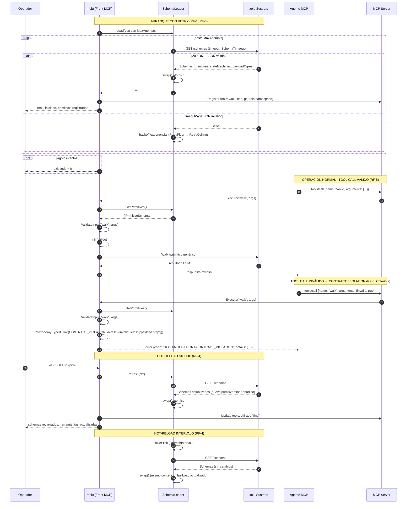

# Plan Técnico: Spec 003 — Schema Reader

## Archivos y Responsabilidades

| Archivo | Responsabilidad |
|---------|-----------------|
| `pkg/schema/loader.go` | **Crear**: `SchemaLoader` — carga inicial, hot-reload (SIGHUP/intervalo), diff atómico, expone `GetPrimitives()` para registro MCP. |
| `pkg/schema/loader_test.go` | **Crear**: Tests unitarios: carga inicial, validación estructura, hot-reload atómico, diff add/remove, concurrencia (-race). |
| `pkg/schema/client.go` | **Crear**: Interfaz `SchemaClient` (mockeable) con `FetchSchemas(ctx) (Schemas, error)`; implementación real `XoluSchemaClient` con HTTP + timeouts. |
| `pkg/schema/client_test.go` | **Crear**: Tests de cliente: éxito, timeout, 5xx, JSON inválido, estructura inesperada. |
| `pkg/schema/types.go` | **Crear**: Tipos `Schemas`, `PrimitiveSchema` (name, description, inputSchema JSON), `StateMachine`, `Transition`, `PayloadType`. |
| `pkg/schema/validation.go` | **Crear**: `ValidateInput(primitiveName, args) *taxonomy.TypedError` — retorna `CONTRACT_VIOLATION` con `details.invalidFields[]` usando `gojsonschema`. |
| `pkg/schema/validation_test.go` | **Crear**: Tests validación: éxito, campos faltantes, tipos incorrectos, enum inválido, nested objects. |
| `pkg/config/config.go` | **Modificar**: Añadir `MOLU_FRONT_SCHEMA_REFRESH_INTERVAL`, `MOLU_FRONT_SCHEMA_RETRY_FLOOR`, `MOLU_FRONT_SCHEMA_RETRY_CEILING`, `MOLU_FRONT_SCHEMA_MAX_ATTEMPTS`, `MOLU_FRONT_SCHEMA_TIMEOUT` con defaults y validación. |
| `pkg/config/config_test.go` | **Modificar**: Tests validación nuevas variables de entorno. |
| `pkg/exec/probe.go` | **Modificar**: Inyectar `SchemaLoader` en probe para que `Run()` pueda notificar recarga (opcional) o mantener desacoplado. |
| `cmd/molu/main.go` | **Modificar**: Wiring `SchemaLoader.Load()` al arranque (con retry/backoff RF-3), `Refresh()` en goroutine con ticker + signal handler SIGHUP, registro primitivos en MCP server tras carga exitosa. |
| `pkg/taxonomy/errors.go` | **Ya existe**: `NewContractViolation(invalidFields []string)` constructor con prefijo `XOLU-MOLU-FRONT-CONTRACT_VIOLATION`. |
| `pkg/taxonomy/integration_test.go` | **Modificar/Extender**: Añadir `TestIntegration_ContractViolation_InvalidInput` — flujo E2E: tool call con args inválidos → `CONTRACT_VIOLATION` con `details.invalidFields[]` (Criterio 2). |
| `docs/diagrams/003-schema-reader-sequence.mmd` | **Crear**: Diagrama Mermaid: arranque + retry, carga exitosa, registro MCP, tool call válido, tool call inválido → CONTRACT_VIOLATION, hot-reload SIGHUP, hot-reload intervalo. |
| `docs/diagrams/003-schema-reader-sequence.pdf` | **Generar**: Renderizado del diagrama (CI con `mmdc`). |

---

## Modelos y Contratos

### `pkg/schema/types.go` — Tipos de dominio

```go
// PrimitiveSchema: un primitivo genérico (walk, find, get) sin namespace
type PrimitiveSchema struct {
    Name        string                 `json:"name"`        // "walk" | "find" | "get"
    Description string                 `json:"description"`
    InputSchema map[string]interface{} `json:"inputSchema"` // JSON Schema Draft 2020-12
}

// StateMachine: definición de máquina de estado desde xolu
type StateMachine struct {
    Name         string            `json:"name"`
    InitialState string            `json:"initialState"`
    States       []string          `json:"states"`
    Transitions  []Transition      `json:"transitions"`
}

// Transition: transición entre estados
type Transition struct {
    From     string `json:"from"`
    To       string `json:"to"`
    Event    string `json:"event"`     // nombre del primitivo que dispara: "walk" | "find" | "get"
    Payload  string `json:"payload"`   // referencia a PayloadType
    Guard    string `json:"guard,omitempty"` // expresión de guarda opcional
}

// PayloadType: definición de tipo de payload
type PayloadType struct {
    Name       string                 `json:"name"`
    Schema     map[string]interface{} `json:"schema"` // JSON Schema
}

// Schemas: respuesta completa de GET /schemas
type Schemas struct {
    Primitives    []PrimitiveSchema `json:"primitives"`
    StateMachines []StateMachine    `json:"stateMachines"`
    PayloadTypes  []PayloadType     `json:"payloadTypes"`
}
```

### `pkg/schema/client.go` — Interfaz `SchemaClient`

```go
// SchemaClient: interfaz mínima para obtener schemas (mockeable)
type SchemaClient interface {
    FetchSchemas(ctx context.Context) (Schemas, error)
}

// XoluSchemaClient: implementación real contra xolu HTTP
type XoluSchemaClient struct {
    baseURL    string
    httpClient *http.Client
    timeout    time.Duration
}

func NewXoluSchemaClient(baseURL string, timeout time.Duration) *XoluSchemaClient {
    return &XoluSchemaClient{
        baseURL: baseURL,
        httpClient: &http.Client{Timeout: timeout},
        timeout: timeout,
    }
}

func (c *XoluSchemaClient) FetchSchemas(ctx context.Context) (Schemas, error) {
    req, _ := http.NewRequestWithContext(ctx, "GET", c.baseURL+"/schemas", nil)
    resp, err := c.httpClient.Do(req)
    if err != nil {
        return Schemas{}, fmt.Errorf("fetch schemas: %w", err)
    }
    defer resp.Body.Close()
    if resp.StatusCode >= 500 {
        return Schemas{}, fmt.Errorf("xolu %d: %s", resp.StatusCode, resp.Status)
    }
    var schemas Schemas
    if err := json.NewDecoder(resp.Body).Decode(&schemas); err != nil {
        return Schemas{}, fmt.Errorf("decode schemas: %w", err)
    }
    return schemas, nil
}
```

### `pkg/schema/loader.go` — `SchemaLoader`

```go
// LoaderConfig: configuración de reintentos y refresh
type LoaderConfig struct {
    RefreshInterval time.Duration // MOLU_FRONT_SCHEMA_REFRESH_INTERVAL
    RetryFloor      time.Duration // MOLU_FRONT_SCHEMA_RETRY_FLOOR
    RetryCeiling    time.Duration // MOLU_FRONT_SCHEMA_RETRY_CEILING
    MaxAttempts     int           // MOLU_FRONT_SCHEMA_MAX_ATTEMPTS (0 = ilimitado)
    Timeout         time.Duration // MOLU_FRONT_SCHEMA_TIMEOUT
}

// SchemaLoader: carga atómica + hot-reload
type SchemaLoader struct {
    mu           sync.RWMutex
    client       SchemaClient
    config       LoaderConfig
    primitives   []PrimitiveSchema // snapshot atómico para MCP registration
    stateMachines []StateMachine
    payloadTypes  []PayloadType
    lastLoad     time.Time
    lastError    error
    stopCh       chan struct{}
    wg           sync.WaitGroup
}

func NewSchemaLoader(client SchemaClient, config LoaderConfig) *SchemaLoader {
    return &SchemaLoader{
        client:  client,
        config:  config,
        stopCh:  make(chan struct{}),
    }
}

// Load: carga inicial con backoff (RF-1, RF-3)
func (l *SchemaLoader) Load(ctx context.Context) error {
    attempt := 0
    delay := l.config.RetryFloor
    for {
        schemas, err := l.client.FetchSchemas(ctx)
        if err == nil {
            l.swap(schemas)
            return nil
        }
        l.lastError = err
        attempt++
        if l.config.MaxAttempts > 0 && attempt >= l.config.MaxAttempts {
            return fmt.Errorf("schema load failed after %d attempts: %w", attempt, err)
        }
        select {
        case <-ctx.Done():
            return ctx.Err()
        case <-time.After(delay):
            delay = min(delay*2, l.config.RetryCeiling)
        }
    }
}

// Refresh: recarga en caliente (SIGHUP o ticker) — swap atómico (RF-4)
func (l *SchemaLoader) Refresh(ctx context.Context) error {
    schemas, err := l.client.FetchSchemas(ctx)
    if err != nil {
        return err
    }
    l.swap(schemas)
    return nil
}

// swap: actualización atómica bajo write lock
func (l *SchemaLoader) swap(schemas Schemas) {
    l.mu.Lock()
    defer l.mu.Unlock()
    l.primitives = schemas.Primitives
    l.stateMachines = schemas.StateMachines
    l.payloadTypes = schemas.PayloadTypes
    l.lastLoad = time.Now()
    l.lastError = nil
}

// GetPrimitives: snapshot inmutable para registro MCP (lectura concurrente segura)
func (l *SchemaLoader) GetPrimitives() []PrimitiveSchema {
    l.mu.RLock()
    defer l.mu.RUnlock()
    // copia para evitar aliasing
    out := make([]PrimitiveSchema, len(l.primitives))
    copy(out, l.primitives)
    return out
}

// Run: goroutine de refresh periódico + signal handler (RF-4)
func (l *SchemaLoader) Run(ctx context.Context) {
    l.wg.Add(1)
    go func() {
        defer l.wg.Done()
        ticker := time.NewTicker(l.config.RefreshInterval)
        defer ticker.Stop()
        for {
            select {
            case <-ctx.Done():
                return
            case <-l.stopCh:
                return
            case <-ticker.C:
                _ = l.Refresh(ctx) // error logged internamente
            }
        }
    }()
}

// Stop: detiene goroutine de refresh
func (l *SchemaLoader) Stop() {
    close(l.stopCh)
    l.wg.Wait()
}
```

### `pkg/schema/validation.go` — Validación de entrada (RF-5)

```go
// ValidateInput: valida args contra inputSchema del primitivo
// Retorna nil si OK, *taxonomy.TypedError con CONTRACT_VIOLATION si falla
func ValidateInput(primitives []PrimitiveSchema, primitiveName string, args map[string]interface{}) *taxonomy.TypedError {
    // buscar primitivo
    var target *PrimitiveSchema
    for i := range primitives {
        if primitives[i].Name == primitiveName {
            target = &primitives[i]
            break
        }
    }
    if target == nil {
        return taxonomy.NewNotOffered(primitiveName) // no debería pasar si RPI filtra bien
    }
    // compilar schema JSON
    schemaLoader := gojsonschema.NewGoLoader(target.InputSchema)
    docLoader := gojsonschema.NewGoLoader(args)
    result, err := gojsonschema.Validate(schemaLoader, docLoader)
    if err != nil {
        return taxonomy.NewContractViolation([]string{"_schema_compile_error: " + err.Error()})
    }
    if result.Valid() {
        return nil
    }
    // extraer nombres de campos inválidos
    invalid := make([]string, 0, len(result.Errors()))
    for _, e := range result.Errors() {
        invalid = append(invalid, e.Field())
    }
    return taxonomy.NewContractViolation(invalid)
}
```

---

## Mapeo Explícito a Taxonomía Tipada (§2.4)

| Código Taxonomía | Prefijo Propio | Origen en Schema Reader | Detalles `details` |
|------------------|----------------|-------------------------|-------------------|
| CONTRACT_VIOLATION | `XOLU-MOLU-FRONT-CONTRACT_VIOLATION` | `ValidateInput()` cuando args no cumplen JSON Schema del primitivo | `invalidFields[]` (nombres de campos que fallaron validación) |
| SUBSTRATE_UNAVAILABLE | `XOLU-MOLU-FRONT-SUBSTRATE_UNAVAILABLE` | `SchemaClient.FetchSchemas()` falla (propagado desde probe/client) | `lastSuccessfulContact`, `nextRetryAt`, `attemptNumber`, `maxAttempts` |

---

## Diagrama de Secuencia (Mermaid)



---

## Decisiones Técnicas y Alternativas Descartadas

| Decisión | Justificación | Alternativa Descartada |
|----------|---------------|------------------------|
| **`gojsonschema` para validación** | Estándar, soporta JSON Schema Draft 2020-12, extrae nombres de campos inválidos para `details.invalidFields[]`. | Validación manual con `reflect` — propenso a errores, no cubre allOf/anyOf/enum/format. |
| **`SchemaLoader.swap()` atómico con RWMutex** | Lecturas concurrentes (`GetPrimitives`) sin bloqueo; escritura exclusiva en `Load`/`Refresh`. Hot-reload no bloquea tool calls. | Channel-based swap — más complejo, latencia añadida en reads. |
| **`PrimitiveSchema` sin namespace** | Cumple RF-7 y §2.6: primitivos genéricos = sin namespace. Dominio = con namespace. | Un solo tipo con campo `Namespace string` — rompe convención estricta, requiere checks en todos lados. |
| **`SchemaClient` interface en `pkg/schema`** | Desacopla loader de cliente HTTP; tests usan fake sin red. | Cliente HTTP directo en loader — acopla I/O, difícil testear fallos de red/timeouts. |
| **`MaxAttempts=0` = ilimitado** | Consistente con Spec 002 (`StartupMaxAttempts=0`). Idiomático Go. | Valor negativo o `math.MaxInt` — menos claro. |
| **SIGHUP + ticker para refresh** | SIGHUP = recarga inmediata operador; ticker = refresco automático periódico. | Solo ticker — latencia hasta próximo tick. Solo SIGHUP — sin refresco automático. |

---

## Estrategia de Tests

### Unitarios (`go test -v -race ./pkg/schema/...`)

| Test | RF | Descripción |
|------|----|-------------|
| `TestLoadSuccess` | RF-1, RF-2 | Carga inicial exitosa, parseo correcto, `GetPrimitives` retorna 3 primitivos. |
| `TestLoadRetryBackoff` | RF-3 | Fallos iniciales → backoff exponencial → éxito en intento N. |
| `TestLoadMaxAttemptsExceeded` | RF-3 | `MaxAttempts=3` → error tras 3 fallos. |
| `TestLoadContextCancellation` | RF-3 | `ctx.Done()` durante backoff → retorna error contexto. |
| `TestRefreshAtomicSwap` | RF-4 | `Refresh` actualiza `GetPrimitives` atómicamente; lectores concurrentes ven snapshot consistente. |
| `TestRefreshAddRemovePrimitive` | RF-4 | Diff: nuevo primitivo añadido, uno eliminado; `GetPrimitives` refleja cambio. |
| `TestValidateInputSuccess` | RF-5 | Args válidos → `nil`. |
| `TestValidateInputMissingRequired` | RF-5 | Campo `required` faltante → `CONTRACT_VIOLATION` con `invalidFields["field"]`. |
| `TestValidateInputTypeMismatch` | RF-5 | Tipo incorrecto (string vs int) → `CONTRACT_VIOLATION`. |
| `TestValidateInputEnumViolation` | RF-5 | Valor fuera de `enum` → `CONTRACT_VIOLATION`. |
| `TestValidateInputNestedObject` | RF-5 | Validación recursiva en objeto anidado. |
| `TestSchemaClientTimeout` | - | `FetchSchemas` respeta timeout configurado. |
| `TestSchemaClient5xx` | - | 500/503 → error con status code. |
| `TestSchemaClientInvalidJSON` | - | Respuesta no-JSON → error decode. |
| `TestLoaderConcurrency` | - | `go test -race`: múltiples goroutines `GetPrimitives` + `Refresh` simultáneas. |

### Integración (`go test -v -race ./pkg/taxonomy/... -run Integration`)

| Test | RF | Descripción |
|------|----|-------------|
| `TestIntegration_ContractViolation_InvalidInput` | RF-5, Criterio 2 | **NUEVO**: Flujo E2E: tool call `walk` con args inválidos → `CONTRACT_VIOLATION` con `details.invalidFields[]` (ej: `["payload.step", "payload.transition"]`). Usa `MockSchemaClient` + `MockXoluClient`. |

### Cobertura y Validación

- **Comando gate**: `go test -v -race ./...` (cero data races en todo el repo).
- **Cobertura objetivo**: > 70% en `pkg/schema/`, > 60% en `pkg/taxonomy/`.
- **Diagramas**: `docs/diagrams/003-schema-reader-sequence.mmd` existe; PDF generado en CI con `mmdc`.

---

## Matriz de Cobertura de Requisitos

| RF | Cobertura en Plan |
|----|-------------------|
| RF-1 (Carga inicial + registro MCP) | `SchemaLoader.Load()` + wiring en `cmd/molu/main.go`; test `TestLoadSuccess`. |
| RF-2 (Parseo + validación estructura) | `XoluSchemaClient.FetchSchemas()` + `Schemas` types; test `TestLoadSuccess` valida campos. |
| RF-3 (Retry con backoff) | `Load()` loop con `RetryFloor`→`RetryCeiling`; tests `TestLoadRetryBackoff`, `TestLoadMaxAttemptsExceeded`. |
| RF-4 (Hot-reload SIGHUP + intervalo) | `SchemaLoader.Refresh()` + `Run()` con ticker + signal handler en `main.go`; tests `TestRefreshAtomicSwap`, `TestRefreshAddRemovePrimitive`. |
| RF-5 (Validación entrada → CONTRACT_VIOLATION) | `ValidateInput()` con `gojsonschema`; tests `TestValidateInput*`. |
| RF-6 (Config `MOLU_FRONT_SCHEMA_*`) | `pkg/config/config.go` carga y valida todas; defaults documentados. |
| RF-7 (Sin namespace en primitivos) | `PrimitiveSchema.Name` = "walk"|"find"|"get"; tests verifican ausencia de prefijo. |

---

## Notas de Implementación (para tasks.md)

- **T1-T3**: Types + Client + Loader (estructura base, compilación).
- **T4-T6**: Tests unitarios Loader (rojo) → implementación Load/Refresh (verde).
- **T7-T9**: Tests unitarios Validación (rojo) → implementación ValidateInput (verde).
- **T10**: Tests Cliente HTTP (rojo → verde).
- **T11**: Config `MOLU_FRONT_SCHEMA_*` en `config.go` + tests.
- **T12**: Wiring en `cmd/molu/main.go`: `Load()` al arranque, `Run()` en goroutine, signal handler SIGHUP, registro MCP tras carga.
- **T13**: Test de integración `CONTRACT_VIOLATION` (rojo → verde).
- **T14**: Diagrama Mermaid (`.mmd`) + render PDF.
- **T15**: Suite completa `go test -v -race ./...` + cobertura.

**Dependencias**: Spec 001 (taxonomy), Spec 002 (probe, config base) completadas.